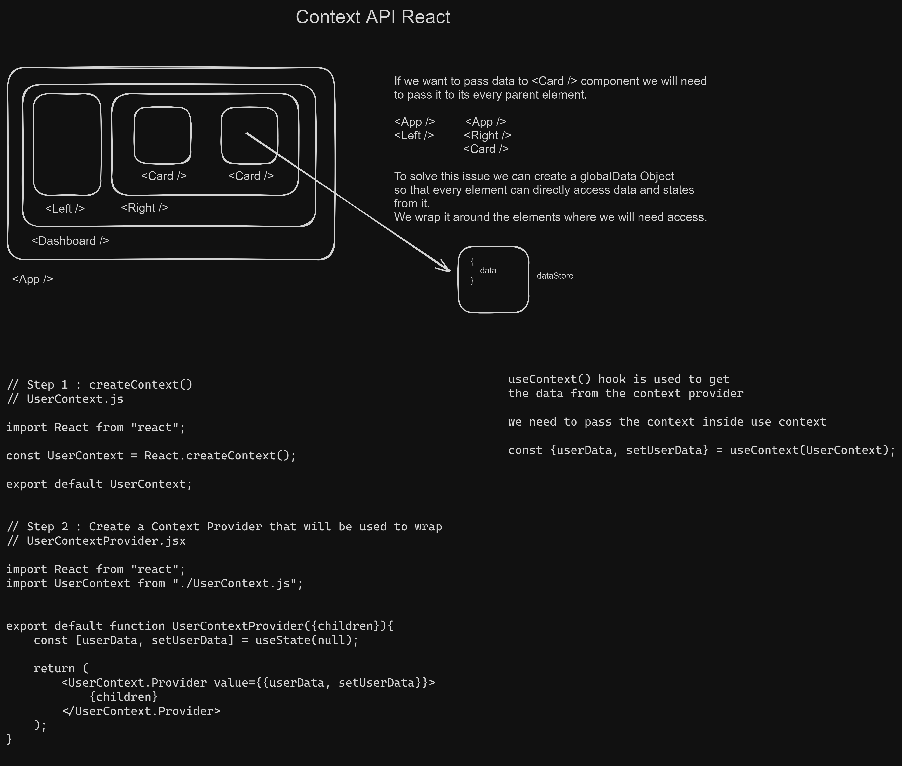

# React101Basics

### 01_basic_react_app

- react app created using the cra utility

### 01_vite_react_app

- react app created using the vite

### 02_counter

- basic counter app (helps with understanding of useState hook)

### 03_tailwind_and_props

- helps understanding integrating tailwind with react and how to pass props in the components

### 04_bg_changer

- a small project which changes background color on click of buttons (helps understand useState hook)

### 05_password_generator

- random password generator project (helps to understand working of useCallback(), useEffect(), useRef() hooks)

### 06_currency_converter

- real time currency converter project that uses external api to get real time conversion rate data (helps in createing custom hooks and working of useId() hook)

### 07_react_router_dom

- simple project to understand pagination and adding links using react router dom (createBrowserRouter(), Link, NavLink, createRoutesFromElements(), RouterProvider, loader, useParams(), useLoaderData())

### 08_mini_context

- Simple project to understand state management using the Context Api.
- we create a context and global data store so that we can access
- (helps in understanding of createContext(), useContext() hooks)
  

### 09_context_theme_switcher

- A simple project that toggles between dark and light theme
- (helps in understanding of createContext(), useContext() and also create custom hook to access values from context dorectly by creating abstraction of useContext() hook)

### 10_todo_context_local

- TodoProject with CRUD functionalities
- Created using context api (createContext(), useContext())
- Helps understand working of localstorage to store and retrieve data

### 11_todo_redux_toolkit

- TodoProject with CRUD functionalities using `react-redux` & `redux-toolkit`
- Helps understanding (configureStore(), createSlice(), useDispatch(), useSelector())
